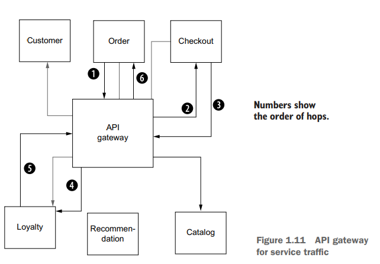

# Chanllenges of going faster

## The following things must be addressed when moving to a services-oriented architecture:

1. Keeping faults from jumping isolation boundaries
2. Building applications/services capable of responding to changes in their environment
3. Building systems capable of running in partially failed conditions
4. Understanding what’s happening to the overall system as it constantly changes and evolves
5. Inability to control the runtime behaviors of the system
6. Implementing strong security as the attack surface grows
7. Lowering the risk of making changes to the system
8. Enforcing policies about who or what can use system components, and when

## Service interactions resilience

Some patterns have evolved to help make applications more resilient to unplanned, unexpected failures:

1. Client-side load balancing: Give the client the list of possible endpoints, and let it decide which one to call.
2. Service discovery: A mechanism for finding the periodically updated list of healthy endpoints for a particular logical service.
3. Circuit breaking: Shed load for a period of time to a service that appears to be misbehaving.
4. Bulkheading: Limit client resource usage with explicit thresholds (connections, threads, sessions, and so on) when making calls to a service.
5. Timeouts: Enforce time limitations on requests, sockets, liveness, and so on when making calls to a service.
6. Retries: Retry a failed request.
7. Retry budgets: Apply constraints to retries: that is, limit the number of retries in a given period (for example, only retry 50% of the calls in a 10-second window).
8. Deadlines: Give requests context about how long a response may still be useful; if outside the deadline, disregard processing the request.

## Understanding what’s happening in real time

As we make changes to our services, do we understand what impact (positive or negative) they will have? Do we know how things are running before we make changes?

Observing the system with metrics, logs, and traces is a crucial part of running a services architecture to ensure that the system is not on the verge of collapse.

# Solving these challenges with application libraries

Large internet companies like google and netflix pioneered the cloud infrastructure as we know it today.
they built application libraries to solve the challenges of running services in a cloud native environments like:
- Hystrix: Circuit breaking and bulkheading
- Ribbon: Client-side load balancing
- Eureka: Service registration and discovery
- Zuul: Dynamic edge proxy

## Drawbacks to application-specific libraries

Although we’ve mitigated a concern about large-scale services architectures when we decentralize and distribute the implementation of application resiliency into the
applications themselves, we’ve introduced some new challenges.

- The first challenge is around the expected assumptions of any application:
    If we wish to introduce a new service into our architecture, it will be constrained to implementation decisions made by other people and other teams.

- The second issue is restrictions around introducing a new language or framework to implement a service.

- Finally, maintaining a handful of libraries across a bunch of programming languages and frameworks requires a lot of discipline and is very hard to get right.

Although the decentralization of application networking is better for cloud architectures, the operational burden and constraints this approach puts on a system in
exchange will be difficult for most organizations to swallow. 

# Pushing these concerns to the infrastructure

These basic application-networking concerns are not specific to any particular application, language, or framework. Retries, timeouts, client-side load balancing, circuit
breaking, and so on are also not differentiating application features.
They are critical concerns to have as part of your service, but investing massive time and resources into language-specific implementations for each language you intend to use (including the other drawbacks from the previous section) is a waste of time.
What we really want is a technology-agnostic way to implement these concerns and relieve applications from having to do so themselves.

## The application-aware service proxy

Using a proxy is a way to move these horizontal concerns into the infrastructure.
A proxy is an intermediate infrastructure component that can handle connections and redirect them to appropriate backends.
We use proxies all the time (whether we know it or not) to handle network traffic, enforce security, and load balance work to backend servers.
For example, **HAProxy** is a simple but powerful reverse proxy for distributing connections across many backend servers. 

What we want for this problem, however, is a proxy that’s application aware and able to perform application networking on behalf of our services
This proxy needs to understand application constructs like messages and requests, unlike more traditional infrastructure proxies, which understand connections and packets.  
In other words, we need a layer 7 proxy.

## Meet the Envoy proxy

[Envoy](http://envoyproxy.io) is a service proxy that has emerged in the open source community as a versatile, performant, and capable application-layer proxy.  
It is capable of implementing networking concerns like retries, timeouts, circuit breaking, client-side load balancing, service discovery, security, and metrics collection without any explicit language or framework dependencies.  
Envoy implements all of that out-of-process from the application.  
  
The power of Envoy is not limited to these application-layer resilience aspects. Envoy also captures many application-networking metrics like requests per second, number
of failures, circuit-breaking events, and more.  
By using Envoy, we can automatically get visibility into what’s happening between our services, which is where we start to see a lot of unanticipated complexity.  
  
The Envoy proxy forms the foundation for solving cross-cutting, horizontal reliability and observability concerns for a services architecture and allows us to push these concerns outside of the applications and into the infrastructure.  
  
We can deploy service proxies alongside our applications to get these features (resilience and observability) out-of-process from the application, but at a fidelity that
is very application specific.  
  
Service proxies can also do things like collect distributed tracing spans so we can stitch together all the steps taken by a particular request. We can see how long each
step took and look for potential bottlenecks or bugs in our system.
  
This proxy + application combination forms the foundation of a communication bus known as a service mesh.

  

## What’s a service mesh?  

Service proxies like Envoy help add important capabilities to our services architecture  
Each application can have its own requirements or configurations for how a proxy should behave, given its workload goals.  
  
Having these proxies in place at each application instance opens opportunities for building interesting higher-order capabilities that we would otherwise have to do in the applications themselves.  
  
A service mesh is a distributed application infrastructure that is responsible for handling network traffic on behalf of the application in a transparent, out-of-process manner.  
  
The following figure shows how service proxies form the data plane through which all traffic is handled and observed.  
  

The data plane is responsible for establishing, securing, and controlling the traffic through the mesh.  
  
The data plane behavior is configured by the control plane.  
The control plane is the brain of the mesh and exposes an API for operators to manipulate network behaviors. Together, the data plane and the control plane provide important capabilities necessary in any cloud-native architecture:  

- Service resilience  
    The service mesh takes on the responsibility of making service communication resilient to failures by implementing capabilities like retries, timeouts, and circuit breakers.  
- Observability signals  
    we’re able to capture detailed signals about the behavior of the network by tracking metrics like request spikes, latency, throughput, failures, and so on.  
- Traffic control capabilities  
    Since all the traffic flows through the mesh, operators can control and direct traffic explicitly.  

- Security  
since the service mesh controls both ends of the network communication between applications, it can enforce strong security like transport-layer encryption with mutual authentication: specifically, using the mutual Transport Layer Security (mTLS) protocol.  

- Policy enforcement  

Service meshes are also capable of handling evolving infrastructure topologies by handling things like service discovery, adaptive and zone-aware load balancing and health checking.  

## Introducing the Istio service mesh

Istio is an open source implementation of a service mesh  
With Istio, applications don’t have to know that they’re part of the service mesh: whenever they interact with the outside world, Istio handles the networking on their behalf.  
  
- Istio’s data plane:  
uses the Envoy proxy and helps you configure your application to have an instance of the service proxy (Envoy) deployed alongside it.  
  
- Istio’s control plane is made up of a few components that provide APIs for end users/operators, configuration APIs for the proxies, security settings, policy declarations, and more.  

Istio was originally built to run on Kubernetes but was written from the perspective of being deployment-platform agnostic.  
This means you can use an Istio-based service mesh across different platforms like Kubernetes, OpenShift, and even traditional deployment environments like virtual machines (VMs).  
  
With a service proxy next to each application instance, applications no longer need language-specific resilience libraries for circuit breaking, timeouts, retries, service discovery, load balancing, and so on. Moreover, the service proxy also handles metrics collection, distributed tracing, and access control.  
  
Since traffic in the service mesh flows through the Istio service proxy, Istio has control points at each application to influence and direct its networking behavior. This
allows a service operator to control traffic flow and implement fine-grained releases with canary releases, dark launches, graduated roll outs, and A/B style testing.  
  
#### Security

Istio has security enabled by default. Since Istio controls each end of the application’s networking path, it can:  
- Transparently encrypt the traffic by default.  
- To take it a step further, Istio can manage key and certificate issuance, installation, and rotation so that services get mutual TLS out of the box.
- Assign a workload identity and embed that into the certificates.
- Also use the identities of different workloads to further implement powerful access-control policies.
- Implement quotas, rate limiting, and organizational policies.
- Using Istio’s policy enforcement, you can create very fine-grained rules about what services are allowed to interact with each other, and which are not.  
  
### How a service mesh relates to an enterprise service bus

ESB integrated applications by placing itself in the center and then comingled application business logic with application routing, transformation, and mediation.  
  
A service mesh’s role is only in application networking concerns.  
Complex business transformations (such as X12, EDI, and HL7), business process orchestration, process exceptions, service orchestration, and so on do not belong in a service mesh.  
Additionally, the service mesh data plane is highly distributed, with its proxies collocated with applications. This eliminates single points of failure or bottlenecks that often appear with an ESB architecture.  

### How a service mesh relates to an API gateway

API gateway infrastructure (not the microservices pattern from http://microservices.io/patterns/apigateway.html) is used in API management suites to provide a public-facing endpoint for an organization’s public APIs.  
  
Its role is to provide:
- security
- rate limiting
- quota management
- metrics collection for these public APIs
- tie into an overall API management solution that includes API plan specification, user registration, billing, and other operational concerns.  
  
- API gateway architectures vary wildly but have been used mostly at the edge of architectures to expose public APIs.
- They have also been used for internal APIs to centralize security, policy, and metrics collection. However, this creates a centralized system through which traffic travels, which can become a source of bottlenecks, as described for the ESB and messaging bus.  
  

The next figure shows how all internal traffic between services traverses the API gateway when used for internal APIs.  
This means for each service in the graph, we’re taking two hops: one to get to the gateway and one to get to the actual service.  
This has implications not just for network overhead and latency but also for security.  
With this multi-hop architecture:
- The API gateway cannot secure the transport mechanism with the application unless the application participates in the security configuration.
- In many cases, an API gateway doesn’t implement resilience capabilities like circuit breakers or bulkheading.  
  
  
In a service mesh:
- proxies are collocated with the services and do not take on additional hops.  
- They’re also decentralized so each application can configure its proxy for its particular workloads and not be affected by noisy neighbor scenarios.  
- Since each proxy lives with its corresponding application instance, it can secure the transport mechanism from end to end without the application knowing or actively participating.  
  
As service mesh technologies like Istio continue to mature, we’ll see API management built on top of the service mesh and not need specialized API gateway proxies.  
  
### Drawbacks to using a service mesh
1. Using a service mesh puts another piece of middleware, specifically a proxy, in the request path.
This proxy can deliver a lot of value; but for those unfamiliar with the proxy, it can end up being a black box and make it harder to debug an application’s behavior.  
The Envoy proxy is specifically built to be very debuggable by exposing a lot about what’s happening on the network but it can still be complex to manage.

2. Another drawback of using a service mesh is in terms of tenancy.  
The more services in the mesh, The more valuable the mesh becomes for operating those services. However, without proper policy, automation, and forethought going into the tenancy and isolation models of the physical mesh deployment, you could end up in a situation where misconfiguring the mesh impacts many services.  

3. A service mesh can expose a lot of opportunities to improve security, observability, and routing control posture.
The downside is that a mesh introduces another layer and another opportunity for complexity.  
It can be difficult to understand how to configure, operate, and, most importantly, integrate it within your existing organizational processes and governance
and between existing teams.
